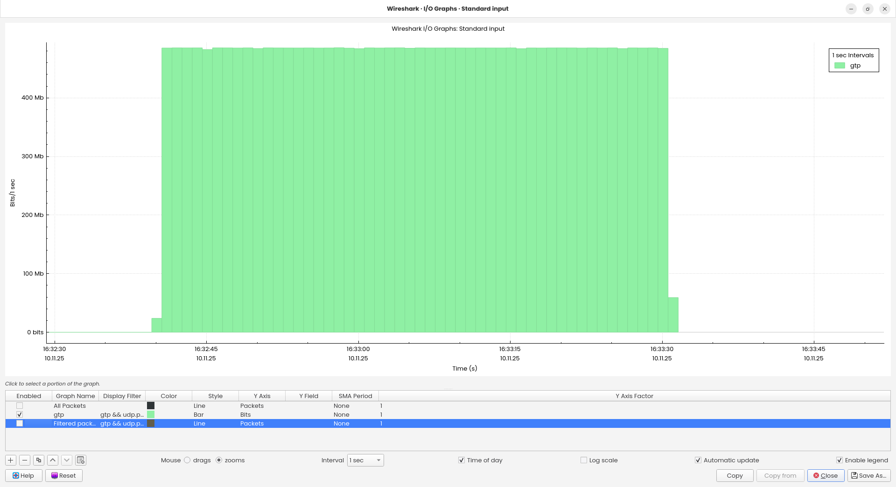
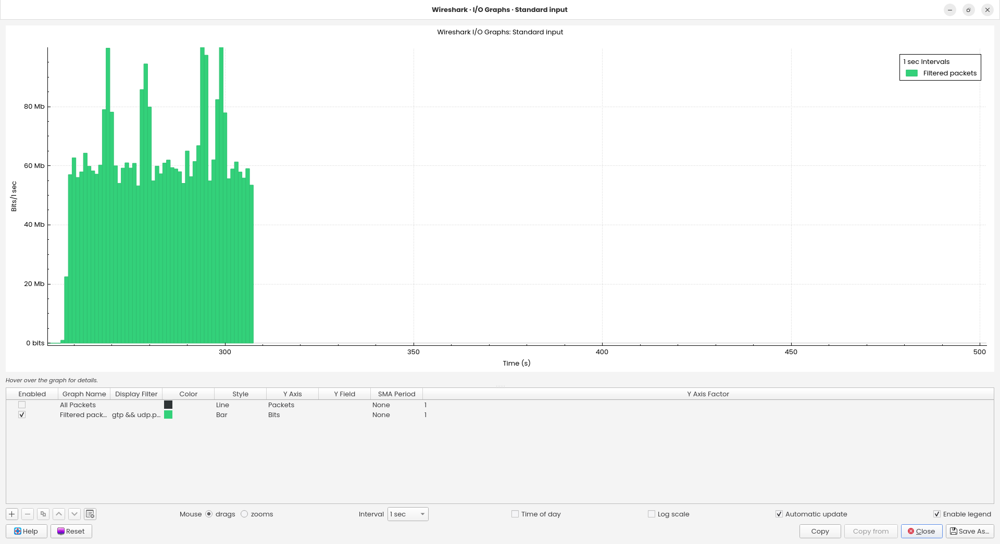
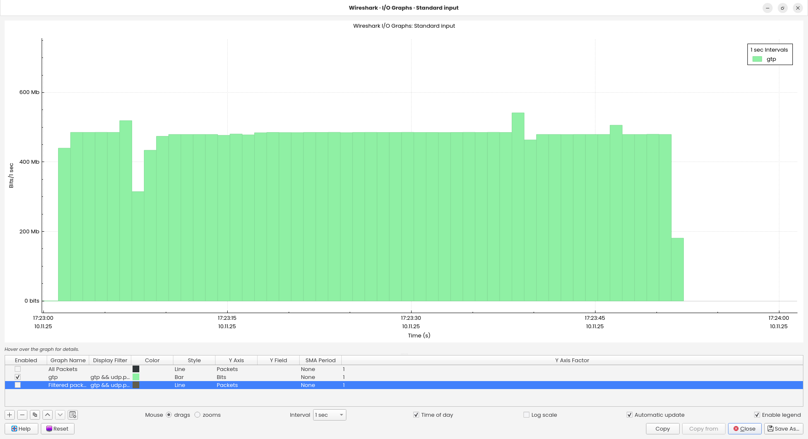

# O-Cloud gNB Deployment Guide - Kubernetes Environment

**O-RAN FrontHaul 7.2 Integration on Kubernetes Platform**

Branch: `production` | Last Updated: 2025-01-01

---

## Contributors

**Infrastructure Team:**
- `Yosafat Marselino`

**O-RU Integration:**
- `Summer`, `Johnson`, `Ming`

**End-to-end Tester**

- `Ming`

**References:**
- [OAI FHI 7.2 Tutorial](https://gitlab.eurecom.fr/oai/openairinterface5g/-/blob/develop/doc/ORAN_FHI7.2_Tutorial.md)
- [OAI Helm Charts](https://gitlab.eurecom.fr/oai/orchestration/charts/-/tree/oai-gnb-fhi-72)
- [RedHat vDU Spec](https://docs.redhat.com/en/documentation/openshift_container_platform/4.14/html/scalability_and_performance/reference-design-specifications)

---

## Table of Contents

- [Progress Checklist](#progress-checklist)
- [Access Information](#access-information)
- [1. Infrastructure Overview](#1-infrastructure-overview)
- [2. BIOS Configuration](#2-bios-configuration)
- [3. Operating System Setup](#3-operating-system-setup)
- [4. Kubernetes Cluster Setup](#4-kubernetes-cluster-setup)
- [5. SR-IOV Network Configuration](#5-sr-iov-network-configuration)
- [6. Build OAI gNB Container](#6-build-oai-gnb-container)
- [7. Deploy Core Network](#7-deploy-core-network)
- [8. Deploy OAI gNB](#8-deploy-oai-gnb)
- [9. O-RU Integration Status](#9-o-ru-integration-status)
- [10. Validation and Testing](#10-validation-and-testing)
- [11. Troubleshooting](#11-troubleshooting)
- [12. Appendix](#12-appendix)

---

## Progress Checklist

| Item                                                     | Status   |
| ------                                                   | -------- |
| [BIOS Configuration](#2-bios-configuration)              | ✅       |
| [OS Installation & RT Kernel](#3-operating-system-setup) | ✅       |
| [GRUB Arguments & CPU Isolation](#31-grub-configuration) | ✅       |
| [Install Required Tools](#32-install-required-tools)     | ✅       |
| [Configure SCTP](#33-configure-sctp)                     | ✅       |
| [Install DPDK](#34-install-dpdk)                         | ✅       |
| [Configure PTP](#35-configure-ptp)                       | ✅       |
| [Master Node Setup](#4-kubernetes-cluster-setup)         | ✅       |
| [CNI Installation (Cilium)](#42-install-cni-cilium)      | ✅       |
| [CNI Installation (Multus)](#43-install-cni-multus)      | ✅       |
| [Worker Node Join](#44-worker-node-configuration)        | ✅       |
| [Kubelet CPU Manager](#45-configure-kubelet-cpu-manager) | ✅       |
| [Install SR-IOV Operator](#5-sr-iov-network-configuration)  | ✅       |
| [Configure SR-IOV Policy](#52-create-sr-iov-network-policy) | ✅       |
| [Verify VF Creation](#53-verify-sr-iov-configuration)       | ✅       |

### Build & Deploy

| Item                                                          | Status   |  Remarks            |
| ------                                                        | -------- | --           |
| [Build OAI gNB Container](#6-build-oai-gnb-container)         | ✅       |  User can also use prebuilt image from OAI if there is no modifications performed on GNB source code.            |
| [Handle CPU Architecture for Old CPUs](#61-cpu-architecture-compatibility) | ⚠️       | - worker-rt-01 cant run the latest oai image. Other workers can.<br />- OAI team confirmed for latest release with compression minimum requirments of CPU should support AVX512 |
| [Deploy Core Network](#7-deploy-core-network)                 | ✅       |              |
| [Deploy OAI gNB 7.2](#8-deploy-oai-gnb)                           | ✅       |              |

### O-RU Integration Status

| Vendor   | O-RU Model   | Connection   | Worker Node   | NIC            | Status   | Section                                       |
| -------- | ------------ | ------------ | ------------- | ---            | -------- | ---------                                     |
| [LiteON]() | C3 4T4R      | FH 7.2       | worker-rt-00  | Intel E810-XXV | ✅       | [9.1](#91-liteon-c3-integration-worker-rt-00) |
| Pegatron | C3 4T4R      | FH 7.2       | lavoisier     | Intel E810-XXV | ✅       | [9.3](#93-pegatron-c3-integration-lavoisier)  |
|          | C3 4T4R      | FH 7.2       | lavoisier     | Intel E810-XXV | ✅       | [9.3](#93-pegatron-c3-integration-lavoisier)  |
| Jura     | C3 4T4R      | FH 7.2       | lavoisier     | Intel E810-XXV | ✅       | [9.3](#93-pegatron-c3-integration-lavoisier)  |

### O-RU E2E Test Tracker

| Machine   | Node         | O-RU                                                          | DL       | UL          | VLAN | Remarks         |
| -         | -            | -                                                             | -        | -           | -    | -               |
| Joule     | worker-rt-00 | Jura                                                          | ...      | ...         | 3    | Worker Reconfig |
|           |              | Pegatron                                                      | ...      | ...         | 103  | Worker Reconfig |
|           |              | LiteOn                                                        | ...      | ...         | 6    | Worker Reconfig |
| Lavoisier | lavoisier    | [**Jura**](#10.4-data-plane-test%3A-lavoisier---pegatron)     | 216 Mbps | 60.041 Mbps | 3    |                 |
|           |              | [**Pegatron**](#10.4-data-plane-test%3A-lavoisier---pegatron) | 461 Mbps | 55.65 Mbps  | 103  |                 |
|           |              | [**LiteOn**]()                                                | ...      | ...         | 6    | FH connection OK, UE Cant Find Service |

### Testing & Validation

| Item                                                        | Status   |
| ------                                                      | -------- |
| [NG Setup (gNB-AMF)](#101-ng-setup-verification-gnb--amf)   | ✅       |
| [Fronthaul Connection](#102-fronthaul-connection-gnb--o-ru) | ✅       |
| [UE Attachment](#103-ue-attachment-test)                    | ✅       |
| [Data Plane Throughput](#104-data-plane-test)               | ✅       |


## Access Information

### Master Node (Control Plane)
- IP: 192.168.8.114
- Username: infidel
- Password: Contact administrator

### Worker Node: Joule (Dell R750)
- BMC IP: 192.168.8.222
- BMC User: root
- OS IP: 192.168.8.74
- OS User: infidel
- Status: Production

### Worker Node: Newton (Supermicro)
- BMC IP: 192.168.10.88
- BMC User: ADMIN
- OS IP: 192.168.8.53
- OS User: infidel
- Status: CPU Incompatible (Broadwell)

### Worker Node: Lavoisier (Supermicro)
- BMC IP: N/A
- OS IP: 192.168.8.XXX
- OS User: infidel
- Status: VLAN Issue

---

## 1. Infrastructure Overview

### 1.1 Hardware Specifications

#### Server Specification

| Machine       | CPU Model       | Generation                       | Model ID | Cores       | AV2         | Memory | NIC            | OS          |
| :---          | :---            | :---                             | :---     | :---        | :---        | :---   | :---           | :---        |
| **Joule**     | Xeon Gold 6326Y | **3rd Gen (Ice Lake-SP)**        | 106      | 16C/32T     | Support     | 128GB  | Intel E810-XXV | RHEL 9.6 RT |
| **Lavoisier** | Xeon Gold 6433N | **4th Gen (Sapphire Rapids-SP)** | 143      | **32C/64T** | Support     | 256GB  | Intel E810-XXV | RHEL 9.2 RT |
| **Newton**    | Xeon E5-2695 v4 | **v4 (Broadwell-EP)**            | 79       | **18C/36T** | **Support** | 64GB   | N/A            | RHEL 9.5 RT |


### 1.2 Cluster Network Topology


**Cluster Nodes**


| Node           | Kubernetes version | Remarks                                                            |
| -              | -                  | -                                                                  |
| o-cloud-master | v1.31.13           | Master Node                                                        |
| worker-rt-00   | v1.32.9            | RT Worker Node to run 7.2 GNB                                      |
| lavoisier      | v1.32.9            | RT Worker Node to run 7.2 GNB                                      |
| worker-non-rt  | v1.32.9            | Non-RT Worker node to run common non RT services i.e. Core Network |

---

## 2. BIOS Configuration

### 2.1 Required Settings

> **⚠️ Critical BIOS Settings**
>
> These settings are mandatory for SR-IOV and real-time performance.

| Setting | Required Value | Location | Purpose |
|---------|----------------|----------|---------|
| **SR-IOV Global Enable** | `ENABLED` | Integrated Devices | Enable VF creation |
| **Intel VT-d** | `ENABLED` | Processor Settings | Enable IOMMU |
| **Hyper-Threading** | `DISABLED` | Processor Settings | RT performance |
| **Intel SpeedStep** | `DISABLED` | Power Management | Stable frequency |
| **C-States** | `C1 Only` | Power Management | Low latency |
| **Turbo Boost** | `ENABLED` | Processor Settings | Max performance |

### 2.2 Dell iDRAC Configuration Steps


1. Access iDRAC web interface: `https://192.168.8.222`
2. Navigate to: **Configuration → BIOS Settings**
3. Go to: **Integrated Devices**
4. Set: **SR-IOV Global Enable = ENABLED**
5. Go to: **Processor Settings**
6. Set: **Logical Processor (Hyper-Threading) = DISABLED**
7. Set: **Virtualization Technology = ENABLED**

> **⚠️ Important:** After changing Hyper-Threading setting:
> - System **must be rebooted via iDRAC UI**
> - Rebooting via SSH will **not apply HT changes**
> - Verify with: `lscpu | grep "Thread(s) per core"`


### 2.3 Verify CPU Frequency Control

After enabling custom CPU frequency in BIOS:
```bash
# Check available frequency steps
sudo cpupower frequency-info

# Expected output:
# analyzing CPU 0:
#   driver: acpi-cpufreq
#   available frequency steps:  2.90 GHz, 2.80 GHz, 2.70 GHz, ...
#   current CPU frequency: 2.90 GHz

# Verify sysfs frequency control
cat /sys/devices/system/cpu/cpu0/cpufreq/scaling_min_freq
# Should output: 1200000
```

---

## 3. Operating System Setup

### 3.1 GRUB Configuration

**For Single NUMA Node (16 Physical Cores):**
```bash
sudo vi /etc/default/grub
```
```bash
GRUB_TIMEOUT=5
GRUB_DISTRIBUTOR="$(sed 's, release .*$,,g' /etc/system-release)"
GRUB_DEFAULT=saved
GRUB_DISABLE_SUBMENU=true
GRUB_TERMINAL_OUTPUT="console"
GRUB_CMDLINE_LINUX="mitigations=off usbcore.autosuspend=-1 intel_iommu=on intel_iommu=pt selinux=0 enforcing=0 nmi_watchdog=0 softlockup_panic=0 audit=0 skew_tick=1 isolcpus=managed_irq,domain,0-15 nohz_full=0-15 rcu_nocbs=0-15 kthread_cpus=16-31 rcu_nocb_poll intel_pstate=disable nosoftlockup tsc=nowatchdog cgroup_disable=memory mce=off hugepagesz=1G hugepages=20 hugepagesz=2M hugepages=0 default_hugepagesz=1G skew_tick=1 tsc=reliable iommu=pt vfio_pci.enable_sriov=1"
GRUB_DISABLE_RECOVERY="true"
GRUB_ENABLE_BLSCFG=true
```

**Apply GRUB configuration:**
```bash
sudo grub2-mkconfig -o /boot/grub2/grub.cfg
sudo reboot
```

**Verify after reboot:**
```bash
cat /proc/cmdline
```

Expected output should contain all parameters:
```
BOOT_IMAGE=(hd0,gpt2)/vmlinuz-5.14.0-284.30.1.rt14.315.el9_2.x86_64 root=/dev/mapper/rhel-root ro ... isolcpus=managed_irq,domain,0-15 nohz_full=0-15 rcu_nocbs=0-15 ... hugepagesz=1G hugepages=20 ...
```

### 3.2 Install Real-Time Kernel
```bash
# Set RHEL release version
sudo subscription-manager release --set=9.2

# Enable RT repository
sudo subscription-manager repos --enable rhel-9-for-x86_64-rt-rpms

# Install RT kernel group
sudo dnf groupinstall RT

# Or install specific version
sudo dnf install kernel-rt-5.14.0-284.30.1.rt14.315.el9_2.x86_64

# Set RT kernel as default
sudo grubby --set-default=/boot/vmlinuz-5.14.0-284.30.1.rt14.315.el9_2.x86_64

# Verify default kernel
sudo grubby --default-kernel

# Reboot
sudo reboot

# After reboot, verify RT kernel
uname -r
# Should show: 5.14.0-284.30.1.rt14.315.el9_2.x86_64
```

<summary>Kernel Verification Output</summary>

```bash
[infidel@joule ~]$ uname -r
5.14.0-284.30.1.rt14.315.el9_2.x86_64

[infidel@joule ~]$ cat /etc/redhat-release
Red Hat Enterprise Linux release 9.2 (Plow)
```

### 3.3 Install Required Tools

```bash
# Enable CodeReady Builder repository
sudo subscription-manager repos --enable codeready-builder-for-rhel-9-$(arch)-rpms

# Update system
sudo dnf update -y

# Install development tools
sudo dnf install -y gcc gcc-c++ make kernel-devel kernel-rt-devel

# Install Python and Meson
sudo dnf install -y python3-pip
sudo pip3 install meson==0.58.2

# Install Ninja build system
sudo dnf install -y ninja-build

# Install network and system tools
sudo dnf install -y \
    linuxptp \
    ethtool \
    iproute \
    numactl \
    numactl-devel \
    libconfig-devel \
    lapack-devel \
    blas-devel

# Install SCTP support
sudo dnf install -y \
    lksctp-tools \
    lksctp-tools-devel \
    lksctp-tools-doc \
    kernel-modules-extra
```

### 3.4 Configure SCTP

**Install SCTP module:**
```bash
# Install kernel modules
sudo dnf install -y kernel-rt-modules-extra

# Create SCTP module load configuration
sudo vi /etc/modules-load.d/sctp.conf
```
```bash
sctp
```

**Unblock SCTP:**
```bash
# Comment out SCTP blacklist
sudo vi /etc/modprobe.d/sctp-blacklist.conf
```
```bash
# blacklist sctp
```
```bash
# Also unblock sctp_diag
sudo vi /etc/modprobe.d/sctp_diag-blacklist.conf
```
```bash
# blacklist sctp_diag
```

**Load SCTP module:**

```bash
# Load module immediately
sudo modprobe sctp

# Verify module loaded
lsmod | grep sctp

# Check SCTP support
checksctp
# Should output: SCTP supported
```

<summary>SCTP Verification Output</summary>

```bash
[infidel@joule ~]$ lsmod | grep sctp
sctp                  462848  4
ip6_udp_tunnel         16384  1 sctp
udp_tunnel             24576  1 sctp
libcrc32c              16384  5 nf_conntrack,nf_nat,nf_tables,xfs,sctp

[infidel@joule ~]$ checksctp
SCTP supported
```

### 3.5 Install DPDK

**Download and extract DPDK:**
```bash
cd ~
wget http://fast.dpdk.org/rel/dpdk-20.11.8.tar.xz
tar -xJf dpdk-20.11.8.tar.xz
cd dpdk-stable-20.11.8
```

**Configure and build DPDK:**
```bash
# Configure with NUMA support
meson setup --default-library=static \
             --buildtype=release \
             --reconfigure \
             -Denable_numactl=true \
             build

# Build DPDK
cd build
ninja

# Install DPDK
sudo ninja install
```

**Configure library path:**
```bash
# Create library config
sudo vi /etc/ld.so.conf.d/dpdk.conf
```
```bash
/usr/local/lib64
```
```bash
# Update library cache
sudo ldconfig

# Verify DPDK installation
ls -l /usr/local/lib64/libdpdk*
```

<summary>DPDK Installation Verification</summary>

```bash
[infidel@joule dpdk-stable-20.11.8]$ ls -l /usr/local/lib64/libdpdk*
-rw-r--r--. 1 root root 45234567 Jan  1 10:00 /usr/local/lib64/libdpdk.a

[infidel@joule ~]$ ldconfig -p | grep dpdk
        librte_vhost.so.21 (libc6,x86-64) => /usr/local/lib64/librte_vhost.so.21
        librte_timer.so.21 (libc6,x86-64) => /usr/local/lib64/librte_timer.so.21
        ...
```

### 3.6 Configure PTP

> **⚠️ PTP Synchronization Critical**
>
> Proper PTP sync (RMS < 100) is mandatory for FH 7.2 operation.

**Create PTP configuration:**
```bash
sudo mkdir -p /etc/linuxptp
sudo vi /etc/linuxptp/ptp4l.conf
```
```bash
[global]
domainNumber            24
slaveOnly               1
time_stamping           hardware
tx_timestamp_timeout    1
logging_level           6
summary_interval        0
uds_address             /var/run/ptp4l

[ens7f0]
network_transport       L2
hybrid_e2e              0
```

**Create systemd service for ptp4l:**
```bash
sudo vi /usr/lib/systemd/system/ptp4l.service
```
```bash
[Unit]
Description=Precision Time Protocol (PTP) service
After=network-online.target
Wants=network-online.target

[Service]
Type=simple
ExecStart=/usr/sbin/ptp4l -i ens7f0 -H -2 -s -f /etc/linuxptp/ptp4l.conf

[Install]
WantedBy=multi-user.target
```

**Create systemd service for phc2sys:**
```bash
sudo vi /usr/lib/systemd/system/phc2sys.service
```
```bash
[Unit]
Description=Synchronize system clock or PTP hardware clock (PHC)
After=ntpdate.service ptp4l.service

[Service]
Type=simple
ExecStart=/usr/sbin/phc2sys -a -r -n 24 -w

[Install]
WantedBy=multi-user.target
```

**Enable and start PTP services:**
```bash
# Disable NTP first
sudo timedatectl set-ntp false

# Enable PTP services
sudo systemctl enable ptp4l phc2sys
sudo systemctl start ptp4l phc2sys

# Check status
sudo systemctl status ptp4l
sudo systemctl status phc2sys
```

**Verify PTP synchronization:**
```bash
# Check ptp4l logs (RMS should be < 100)
sudo journalctl -u ptp4l -f | grep rms

# Expected output:
# ptp4l[1956]: [231803.588] rms    6 max   13 freq -11561 +/-   8 delay   273 +/-   0

# Check phc2sys logs (offset should be < 100)
sudo journalctl -u phc2sys -f | grep offset

# Expected output:
# phc2sys[1957]: CLOCK_REALTIME phc offset       -11 s2 freq  +22612 delay    558
```

---

## 4. Kubernetes Cluster Setup

### 4.1 Master Node Initialization
```bash
# Initialize Kubernetes cluster
sudo kubeadm init \
  --apiserver-advertise-address=192.168.8.114 \
  --pod-network-cidr=10.244.0.0/16 \
  --service-cidr=10.96.0.0/12

# Setup kubeconfig for regular user
mkdir -p $HOME/.kube
sudo cp -i /etc/kubernetes/admin.conf $HOME/.kube/config
sudo chown $(id -u):$(id -g) $HOME/.kube/config

# Verify cluster
kubectl get nodes
```

**Configure firewall:**
```bash
# Open required ports
sudo firewall-cmd --permanent --add-port={6443,2379,2380,10250,10251,10252,10257,10259,179}/tcp
sudo firewall-cmd --permanent --add-port=4789/udp
sudo firewall-cmd --reload
```

### 4.2 Install CNI: Cilium
```bash
# Add Cilium Helm repository
helm repo add cilium https://helm.cilium.io/
helm repo update

# Install Cilium (primary CNI)
helm install cilium cilium/cilium \
  --version 1.14.0 \
  --namespace kube-system \
  --set cni.exclusive=false \
  --set hubble.relay.enabled=true \
  --set hubble.ui.enabled=true

# Verify Cilium installation
kubectl get pods -n kube-system -l k8s-app=cilium
```

### 4.3 Install CNI: Multus
```bash
# Install Multus CNI
kubectl apply -f https://raw.githubusercontent.com/k8snetworkplumbingwg/multus-cni/master/deployments/multus-daemonset.yml

# Verify Multus installation
kubectl get pods -n kube-system -l app=multus
```

### 4.4 Worker Node Configuration

**Join worker to cluster:**
```bash
# On worker node, use token from master init output
sudo kubeadm join 192.168.8.114:6443 \
  --token <token-from-master> \
  --discovery-token-ca-cert-hash sha256:<hash-from-master>
```

**Disable swap:**
```bash
sudo swapoff -a
sudo sed -i '/ swap / s/^\(.*\)$/#\1/g' /etc/fstab
```

**Configure kernel modules:**
```bash
# Create module load config
sudo tee /etc/modules-load.d/k8s.conf <<EOF
overlay
br_netfilter
EOF

# Load modules
sudo modprobe overlay
sudo modprobe br_netfilter
```

**Configure sysctl:**
```bash
# Create sysctl config
sudo tee /etc/sysctl.d/k8s.conf <<EOF
net.bridge.bridge-nf-call-iptables = 1
net.ipv4.ip_forward = 1
net.bridge.bridge-nf-call-ip6tables = 1
EOF

# Apply sysctl
sudo sysctl --system
```

**Label worker node:**
```bash
# On master node
kubectl label node worker-rt-00 node-role.kubernetes.io/worker=worker
kubectl label node worker-rt-00 feature.node.kubernetes.io/network-sriov.capable=true
```

### 4.5 Configure Kubelet CPU Manager

> **⚠️ Critical Configuration**
>
> Incorrect kubelet CPU manager configuration can cause system hangs and SSH lockouts.

**Edit kubelet configuration:**
```bash
sudo vi /var/lib/kubelet/config.yaml
```
```yaml
apiVersion: kubelet.config.k8s.io/v1beta1
kind: KubeletConfiguration
cgroupDriver: systemd
cpuManagerPolicy: static
cpuManagerPolicyOptions:
  full-pcpus-only: "true"
topologyManagerPolicy: "best-effort"
featureGates:
  CPUManager: true
  CPUManagerPolicyOptions: true
  CPUManagerPolicyAlphaOptions: true
  CPUManagerPolicyBetaOptions: true
reservedSystemCPUs: "16-31"  # Must match non-isolated CPUs from GRUB
systemReserved:
  cpu: "2000m"
  memory: "2Gi"
kubeReserved:
  cpu: "1000m"
  memory: "1Gi"
failSwapOn: false
containerLogMaxSize: "50Mi"
healthzBindAddress: 127.0.0.1
healthzPort: 10248
clusterDNS:
  - "10.96.0.10"
clusterDomain: "cluster.local"
authentication:
  anonymous:
    enabled: false
  webhook:
    cacheTTL: 0s
    enabled: true
  x509:
    clientCAFile: /etc/kubernetes/pki/ca.crt
authorization:
  mode: Webhook
  webhook:
    cacheAuthorizedTTL: 0s
    cacheUnauthorizedTTL: 0s
```

**Apply kubelet configuration:**
```bash
# Remove CPU manager state
sudo rm -f /var/lib/kubelet/cpu_manager_state

# Restart kubelet
sudo systemctl restart kubelet

# Verify kubelet status
sudo systemctl status kubelet
```

**Verify CPU allocation:**
```bash
# Check allocatable CPUs
kubectl describe node worker-rt-00 | grep -A 10 "Allocatable"

# Expected output should show CPUs available for pods
# Allocatable:
#   cpu:                13
#   memory:             120Gi
#   hugepages-1Gi:      20Gi
```

---

## 5. SR-IOV Network Configuration

### 5.1 Install SR-IOV Network Operator
```bash
# Install SR-IOV operator using Helm
helm install sriov-network-operator \
  oci://ghcr.io/k8snetworkplumbingwg/sriov-network-operator-chart \
  --version 1.5.0 \
  --namespace sriov-network-operator \
  --create-namespace \
  --set sriovOperatorConfig.deploy=true

# Verify installation
kubectl get pods -n sriov-network-operator
```

**Expected pods:**
```
NAME                                      READY   STATUS    RESTARTS   AGE
sriov-device-plugin-xxxxx                 1/1     Running   0          2m
sriov-network-config-daemon-xxxxx         1/1     Running   0          2m
sriov-network-operator-xxxxxxxxxx-xxxxx   1/1     Running   0          3m
```

**Configure SR-IOV operator:**
```bash
kubectl edit sriovoperatorconfig default -n sriov-network-operator
```
```yaml
apiVersion: sriovnetwork.openshift.io/v1
kind: SriovOperatorConfig
metadata:
  name: default
  namespace: sriov-network-operator
spec:
  configDaemonNodeSelector:
    feature.node.kubernetes.io/network-sriov.capable: "true"
  configurationMode: daemon
  enableInjector: false
  enableOperatorWebhook: false
  logLevel: 2
```

### 5.2 Create SR-IOV Network Policy

> **ℹ️ NIC Identification**
>
> First identify your NIC PCI address and port names:
>
> ```bash
> # List network devices
> lspci | grep -i ethernet
>
> # Example output:
> # ca:00.0 Ethernet controller: Intel Corporation Ethernet Controller E810-XXV for SFP (rev 02)
>
> # Check interface names
> ip link show
> ```

**Create SR-IOV policies for OAI gNB:**
```bash
cat <<EOF | kubectl apply -f -
---
apiVersion: sriovnetwork.openshift.io/v1
kind: SriovNetworkNodePolicy
metadata:
  name: oai-uplane-policy
  namespace: sriov-network-operator
spec:
  resourceName: oai_uplane
  nodeSelector:
    feature.node.kubernetes.io/network-sriov.capable: "true"
  priority: 11
  mtu: 9216
  deviceType: vfio-pci
  isRdma: false
  numVfs: 4
  linkType: eth
  nicSelector:
    pfNames:
      - 'ens7f0#0-1'
    rootDevices:
      - '0000:ca:00.0'
---
apiVersion: sriovnetwork.openshift.io/v1
kind: SriovNetworkNodePolicy
metadata:
  name: oai-cplane-policy
  namespace: sriov-network-operator
spec:
  resourceName: oai_cplane
  nodeSelector:
    feature.node.kubernetes.io/network-sriov.capable: "true"
  priority: 12
  mtu: 9216
  deviceType: vfio-pci
  isRdma: false
  numVfs: 4
  linkType: eth
  nicSelector:
    pfNames:
      - 'ens7f0#2-3'
    rootDevices:
      - '0000:ca:00.0'
EOF
```

### 5.3 Verify SR-IOV Configuration

> **⚠️ Node Reboot Required**
>
> After SR-IOV policy creation, the node will automatically reboot to apply VF configuration.

**Check SR-IOV node state:**
```bash
# Wait for node state update
kubectl get sriovnetworknodestates -n sriov-network-operator

# Check VF creation on worker node
kubectl get sriovnetworknodestate worker-rt-00 -n sriov-network-operator -o yaml
```

**Verify VFs on worker node:**
```bash
# On worker node, check for Virtual Functions
lspci | grep Virtual

# Expected output:
# ca:01.0 Ethernet controller: Intel Corporation Ethernet Virtual Function 700 Series (rev 02)
# ca:01.1 Ethernet controller: Intel Corporation Ethernet Virtual Function 700 Series (rev 02)
# ca:01.2 Ethernet controller: Intel Corporation Ethernet Virtual Function 700 Series (rev 02)
# ca:01.3 Ethernet controller: Intel Corporation Ethernet Virtual Function 700 Series (rev 02)

# Check VF driver binding
dpdk-devbind.py --status

# Expected output should show VFs bound to vfio-pci
```

**Verify device plugin resources:**
```bash
# Check if SR-IOV resources are advertised
kubectl get node worker-rt-00 -o json | jq '.status.allocatable'

# Should show:
# {
#   "cpu": "13",
#   "memory": "120Gi",
#   "hugepages-1Gi": "20Gi",
#   "openshift.io/oai_cplane": "2",
#   "openshift.io/oai_uplane": "2"
# }
```

---

## 6. Build OAI gNB Container

### 6.1 CPU Architecture Compatibility

> **⚠️ Critical: CPU Architecture Support**
>
> Containers built on newer CPUs with `-march=native` will crash on older CPUs lacking required instruction sets (AVX512, AVX2, etc.).
>
> **Solution:** Build with explicit CPU architecture target.

**Check CPU model and supported instructions:**
```bash
# Check CPU model
grep "model" /proc/cpuinfo | head -1

# Check supported instruction sets
grep flags /proc/cpuinfo | head -1

# Model 79 = Broadwell (AVX2, no AVX512)
# Model 106/143 = Sapphire Rapids (AVX512)
```

### 6.2 Build Container for Broadwell+ Compatibility

**Create Dockerfile with CPU constraints:**
```dockerfile
# Dockerfile.gNB.fhi72.ubuntu22.broadwell
FROM ubuntu:22.04 AS builder

# Set CPU architecture flags for Broadwell compatibility
ENV CFLAGS="-march=broadwell -mtune=broadwell"
ENV CXXFLAGS="-march=broadwell -mtune=broadwell"

# Install build dependencies
RUN apt-get update && apt-get install -y \
    git build-essential cmake ninja-build \
    python3 python3-pip wget tar \
    libconfig-dev libblas-dev liblapack-dev \
    numactl libnuma-dev \
    libelf-dev libz-dev

# Install meson
RUN pip3 install meson==0.58.2

# Build DPDK
WORKDIR /dpdk
RUN wget http://fast.dpdk.org/rel/dpdk-20.11.9.tar.xz && \
    tar -xJf dpdk-20.11.9.tar.xz && \
    cd dpdk-stable-20.11.9 && \
    meson setup --default-library=static \
                --buildtype=release \
                -Denable_numactl=true \
                build && \
    ninja -C build && \
    ninja -C build install

# Clone and build xRAN library
WORKDIR /phy
RUN git clone https://gerrit.o-ran-sc.org/r/o-du/phy.git . && \
    git checkout oran_f_release_v1.0

WORKDIR /phy/fhi_lib/lib
RUN CFLAGS="-march=broadwell -mtune=broadwell" \
    WIRELESS_SDK_TOOLCHAIN=gcc \
    RTE_SDK=/dpdk/dpdk-stable-20.11.9 \
    XRAN_DIR=/phy/fhi_lib \
    make XRAN_LIB_SO=1

# Clone OAI repository
WORKDIR /oai
RUN git clone https://gitlab.eurecom.fr/oai/openairinterface5g.git . && \
    git checkout 2025.w25

# Build OAI gNB
WORKDIR /oai/cmake_targets
RUN ./build_oai --gNB --ninja -t oran_fhlib_5g \
    --cmake-opt -Dxran_LOCATION=/phy/fhi_lib/lib \
    --cmake-opt -DCMAKE_C_FLAGS="-march=broadwell -mtune=broadwell" \
    --cmake-opt -DCMAKE_CXX_FLAGS="-march=broadwell -mtune=broadwell"

# Runtime stage
FROM ubuntu:22.04

# Install runtime dependencies
RUN apt-get update && apt-get install -y \
    numactl libnuma1 libconfig9 \
    liblapack3 libblas3 libelf1 \
    iproute2 iputils-ping net-tools \
    && rm -rf /var/lib/apt/lists/*

# Copy binaries and libraries
COPY --from=builder /oai/cmake_targets/ran_build/build/nr-softmodem /opt/oai-gnb/bin/
COPY --from=builder /oai/cmake_targets/ran_build/build/liboran_fhlib_5g.so /opt/oai-gnb/lib/
COPY --from=builder /phy/fhi_lib/lib/build/libxran.so /usr/local/lib/
COPY --from=builder /usr/local/lib64/* /usr/local/lib64/

# Update library cache
RUN ldconfig

# Set working directory
WORKDIR /opt/oai-gnb

# Default command
CMD ["/bin/bash"]
```

**Build container:**
```bash
# Build with Podman or Docker
podman build -t oai-gnb-fhi72:broadwell \
  -f Dockerfile.gNB.fhi72.ubuntu22.broadwell .

# Tag for registry
podman tag oai-gnb-fhi72:broadwell quay.bmw.lab/infidel/oai-gnb-fhi72:2025.w25

# Push to registry
podman push quay.bmw.lab/infidel/oai-gnb-fhi72:2025.w25
```

**Verify binary compatibility:**
```bash
# Check CPU instructions in binary
podman run --rm oai-gnb-fhi72:broadwell \
  objdump -d /opt/oai-gnb/bin/nr-softmodem | grep -E "vpaddd|vpand|avx512" | head

# Should NOT contain AVX512 instructions
# If empty output or only AVX2 instructions, build is correct
```

---

## 7. Deploy Core Network

### 7.1 Install Open5GS
```bash
# Clone Open5GS Helm charts
git clone https://github.com/gradiant/openverso-charts.git
cd openverso-charts/charts/open5gs

# Use 5G configuration
cp values-5g.yaml values.yaml

# Build Helm dependencies
helm dependency build
```

### 7.2 Configure Subscriber Data

**Edit MySQL initialization script:**
```bash
vi charts/mysql/initialization/oai_db-basic.sql
```

Add your subscriber information:
```sql
-- Insert authentication credentials
INSERT INTO `AuthenticationSubscription`
  (`ueid`, `authenticationMethod`, `encPermanentKey`, `encOpcKey`, `supi`)
VALUES
  ('001010000062655', '5G_AKA',
   '8baf473f2f8fd09487cccbd7097c6862',  -- Ki
   '8e27b6af0e692e750f32667a3b14605d',  -- OPC
   '001010000062655');

-- Insert session management data
INSERT INTO `SessionManagementSubscriptionData`
  (`ueid`, `servingPlmnid`, `singleNssai`, `dnnConfigurations`)
VALUES
  ('001010000062655', '00101',
   '{"sst": 1, "sd": "FFFFFF"}',
   '{"internet":{"pduSessionTypes":{"defaultSessionType":"IPV4"},"sscModes":{"defaultSscMode":"SSC_MODE_1"},"5gQosProfile":{"5qi":6},"sessionAmbr":{"uplink":"1000Mbps","downlink":"1000Mbps"}}}');
```

### 7.3 Deploy Open5GS
```bash
# Install Open5GS
helm install open5gs -n 5gs-cn --create-namespace .

# Wait for all pods to be ready
kubectl wait --for=condition=ready pod --all -n 5gs-cn --timeout=300s

# Verify deployment
kubectl get pods -n 5gs-cn
```


### 7.4 Access WebUI
```bash
# Port forward WebUI service
kubectl port-forward -n 5gs-cn svc/open5gs-webui 9999:9999

# Access via browser: http://localhost:9999
# Default credentials:
#   Username: admin
#   Password: 1423
```


---

## 8. Deploy OAI gNB

### 8.1 Create Configuration Values

**Create `oai-gnb-values.yaml`:**
```yaml
image:
  repository: quay.bmw.lab/infidel/oai-gnb-fhi72
  tag: "2025.w25"
  pullPolicy: IfNotPresent

config:
  gnbName: "oai-gnb-k8s"
  timeZone: "Asia/Taipei"
  useAdditionalOptions: ""

  # PLMN Configuration
  mcc: "001"
  mnc: "01"
  tac: 1
  sst: 1
  sd: "0xFFFFFF"

  # RF Configuration
  dlArfcn: 649980
  band: 78
  bandwidth: 100
  scs: 30

  # O-RU Configuration
  ruCPlaneMacAdd: "00:aa:ff:bb:ff:cc"
  ruUPlaneMacAdd: "00:aa:ff:bb:ff:cc"

  # Core Network
  amfHost: "open5gs-amf-ngap.5gs-cn"
  amfPort: 38412

# Network Interfaces
multus:
  # N2/N3 interface (control/user plane to core network)
  n2Interface:
    create: true
    IPadd: "192.168.8.74"
    Netmask: "24"
    Gateway: "192.168.8.1"

  # RU interface (fronthaul)
  ruInterface:
    create: true
    cPlaneMacAdd: "00:11:22:33:44:66"
    uPlaneMacAdd: "00:11:22:33:44:66"
    vlan: 4
    mtu: 9216

# SR-IOV Resources
sriov:
  resourceNameCPlane: "oai_cplane"
  resourceNameUPlane: "oai_uplane"

# Resource Allocation
resources:
  limits:
    cpu: "16"
    memory: "32Gi"
    hugepages-1Gi: "20Gi"
    openshift.io/oai_cplane: "1"
    openshift.io/oai_uplane: "1"
  requests:
    cpu: "16"
    memory: "16Gi"
    hugepages-1Gi: "20Gi"
    openshift.io/oai_cplane: "1"
    openshift.io/oai_uplane: "1"

# Node Selection
nodeSelector:
  kubernetes.io/hostname: worker-rt-00

# Tolerations (if node has taints)
tolerations: []
```

### 8.2 Install OAI gNB
```bash
# Clone OAI Helm charts repository
git clone https://gitlab.eurecom.fr/ymarselino/charts.git oai-charts
cd oai-charts/oai-gnb-fhi72

# Install gNB
helm install oai-gnb . \
  -n oai-gnb --create-namespace \
  -f oai-gnb-values.yaml

# Watch pod creation
kubectl get pods -n oai-gnb -w
```

### 8.3 Verify Deployment

**Check pod status:**
```bash
kubectl get pods -n oai-gnb

# Expected output:
# NAME                       READY   STATUS    RESTARTS   AGE
# oai-gnb-xxxxxxxxxx-xxxxx   1/1     Running   0          2m
```

**Check logs:**
```bash
kubectl logs -n oai-gnb <pod-name> -f
```

**Expected successful log patterns:**
```
[NR_PHY] I [o-du 0][rx 12644252 pps   86016 kbps][tx 18740852 pps  127488 kbps]
[NR_PHY] I [o_du0][pusch0 2709478 prach0  451584]
[NR_PHY] I [o_du0][pusch1 2709484 prach1  451584]
[NR_PHY] I [o_du0][pusch2 2709470 prach2  451584]
[NR_PHY] I [o_du0][pusch3 2709484 prach3  451584]
[NR_MAC] I Frame.Slot 512.0
```

> **✅ Healthy Indicators:**
> - `pusch` and `prach` values are **uniform** across all slots
> - Frame.Slot counter increments continuously
> - No "out-of-sync" messages


---

## 9. O-RU Integration Status

### 9.1 LiteON C3 Integration (worker-rt-00)

**Status:** ✅ **Operational**

| Parameter | Value |
|-----------|-------|
| O-RU Model | LiteON C3 4T4R |
| Connection | FrontHaul 7.2 |
| Worker Node | worker-rt-00 (Joule) |
| NIC | Intel E810-XXV |
| VLAN | 4 |
| MTU | 9216 |


**O-RU Configuration:**
```
Band Width              : 100000000 (100 MHz)
Center Frequency        : 3450720000 (3.45072 GHz)
Compression Bit         : 9
Control/User Plane VLAN : 4
M-Plane VLAN           : 0
DU MAC Address         : 00:11:22:33:44:66
RU MAC Address         : 00:aa:ff:bb:ff:cc
Phase Compensation     : Enable
RX Attenuation         : 14
TX Attenuation         : 15
Subcarrier Spacing     : 1 (30 kHz)
PRACH eAxC-ID          : 0x0004, 0x0005, 0x0006, 0x0007
Sync Source            : PTP
```

**Verification:**
```bash
# Check O-RU status
show oru-status

# Expected output:
# Sync State  : SYNCHRONIZED
# RF State    : Ready
# DPD         : Ready
# DuConnected : Ready
```

**gNB Connection:**
```bash
kubectl logs -n oai-gnb <pod-name> | grep -E "o-du|pusch|prach"
```


### 9.2 LiteON C3 Integration (worker-rt-01)

**Status:** ❌ **Blocked - CPU Incompatibility**

| Parameter | Value |
|-----------|-------|
| Worker Node | worker-rt-01 (Newton) |
| CPU | Broadwell-EP (Model 79) |
| Issue | Missing AVX512 instructions |
| NIC | Intel E810-XXV |
| OAM MAC | ac:1f:6b:40:04:b6  |

**Problem:**

Container built on Sapphire Rapids includes AVX512 instructions not supported by Broadwell CPU.

**Error:**
```bash
Program received signal SIGILL, Illegal instruction.
set_softmodem_sighandler () at /oai-ran/executables/softmodem-common.c:231
```


**Resolution:** Container rebuild with Broadwell target (see [6.1](#61-cpu-architecture-compatibility))

### 9.3 Pegatron C3 Integration (lavoisier)

**Status:** ✅ **Operational**

| Parameter   | Value                                  |
| ----------- | -------                                |
| O-RU Model  | Pegatron C3 4T4R                       |
| Worker Node | lavoisier                              |
| NIC         | ~~Intel XXV710~~                       |
|             | Intel E810-XXV                         |
| Issue       | VIRTCHNL mailbox state on Intel XXV710 |

> #### Intel XXV710
> **Problem:**
>
> - XXV710 NIC with port VLAN configuration experiences timing-dependent VF initialization failure in containers (~50% success rate).
> -
>
> **Root Cause:**
>
> 1. VF created → `iavf` driver auto-binds
> 2. Port VLAN configured while `iavf` bound
> 3. Driver switched: `iavf` → `vfio-pci`
> 4. Container starts (time gap)
> 5. DPDK initialization catches stale mailbox state
>
> **Kernel Evidence:**
> ```
> iavf 0000:70:02.0: MAC address assigned
> i40e 0000:70:00.0: Setting VLAN 3 on VF 0
> iavf 0000:70:02.0: Removing device
> vfio-pci 0000:70:02.0: enabling device
> ```
>
> **Solutions Under Evaluation:**
>
> 1. Use VLAN 0 + configure at switch level
> 2. Blacklist `iavf`, setup VFs at boot via systemd
> 3. Deploy on baremetal (no containerization)

#### Intel E810-XXV

| Interface | Status |
| -         | -      |
| N2        |  OK      |
| N3        |  OK      |
| FH        | OK |
| E2E       |        |

- FH connection OK
- E2E Ok


### 9.4 Foxconn Integration

**Status:** 🕒 **Pending**

Physical connection and configuration pending.

---

## 10. Validation and Testing

### 10.1 NG Setup Verification (gNB ↔ AMF)

**Check AMF logs:**
```bash
kubectl logs -n 5gs-cn <amf-pod-name> | grep -i "ng setup"
```

**Expected output:**
```
[amf] INFO: gNB-N2 accepted[10.0.6.105]:36800 in ng-path module
[amf] INFO: gNB-N2 accepted[10.0.6.105] in master_sm module
[amf] INFO: [Added] Number of gNBs is now 1
[amf] INFO: gNB-N2[10.0.6.105] max_num_of_ostreams : 2
```


### 10.2 Fronthaul Connection (gNB ↔ O-RU)

**Check O-RU status:**
```bash
# On O-RU console
show oru-status

# Expected:
Sync State  : SYNCHRONIZED
RF State    : Ready
DPD         : Ready
DuConnected : Ready
```

**Check gNB fronthaul stats:**
```bash
kubectl logs -n oai-gnb <pod-name> | tail -50
```

**Healthy output indicators:**
```
[NR_PHY] I [o-du 0][rx 12730266 pps   86014 kbps][tx 18868340 pps  127488 kbps]
[NR_PHY] I [o_du0][pusch0 2727910 prach0  454656]
[NR_PHY] I [o_du0][pusch1 2727914 prach1  454656]
[NR_PHY] I [o_du0][pusch2 2727902 prach2  454656]
[NR_PHY] I [o_du0][pusch3 2727916 prach3  454656]
```

> **⚠️ Critical: Uniform Slot Values**
>
> `pusch` and `prach` values **must be uniform** across all slots.
>
> - ✅ Uniform values = Healthy fronthaul
> - ❌ Zero values = O-RU not connected
> - ❌ Inconsistent values = PTP sync issue or CPU isolation problem


### 10.3 UE Attachment Test

**Monitor gNB during UE attach:**
```bash
kubectl logs -n oai-gnb <pod-name> -f | grep -E "RAPROC|Registration|in-sync"
```

**Expected sequence:**
```
[RAPROC] 801.19 Initiating RA procedure with preamble 1, energy 51.0 dB
[NR_MAC] 801.19 UE RA-RNTI 010b TC-RNTI f939: Activating RA process
[NR_MAC] UE f939: Msg3 scheduled at 802.13 (802.8 TDA 2)
[NR_MAC] 802.8 Send RAR to RA-RNTI 010b

UE RNTI f939 CU-UE-ID 1 in-sync PH 34 dB PCMAX 22 dBm, average RSRP -71
UE f939: CQI 12, RI 2, PMI (11,0)
UE f939: dlsch_rounds 766/88/36/14, dlsch_errors 5, BLER 0.01931 MCS (1) 9
UE f939: ulsch_rounds 1188/36/16/14, ulsch_errors 7, BLER 0.00041 MCS (1) 9
UE f939: MAC:    TX    4264188 RX    537143 bytes
```

**Check AMF logs:**
```bash
kubectl logs -n 5gs-cn <amf-pod> | tail -20
```

**Expected:**
```
[gmm] INFO: Registration request
[gmm] INFO: [imsi-001010000062655] Registration complete
[gmm] INFO: [imsi-001010000062655] Configuration update command
```


### 10.4 Data Plane Test: Lavoisier - Metanoia Jura O-RU

#### GNB GTP DL



#### GNB GTP UL


#### UE Iperf DL
```log
onnecting to host 192.168.8.82, port 5201
Reverse mode, remote host 192.168.8.82 is sending
[  4] local 10.45.0.3 port 50547 connected to 192.168.8.82 port 5201
[ ID] Interval           Transfer     Bandwidth       Jitter    Lost/Total Datagrams
[  4]   0.00-1.00   sec  31.4 MBytes   263 Mbits/sec  0.401 ms  0/25316 (0%)
[  4]   1.00-2.00   sec  28.0 MBytes   235 Mbits/sec  0.028 ms  0/22555 (0%)
[  4]   2.00-3.00   sec  26.7 MBytes   224 Mbits/sec  0.072 ms  0/21548 (0%)
[  4]   3.00-4.00   sec  24.2 MBytes   203 Mbits/sec  0.023 ms  12743/32274 (39%)
[  4]   4.00-5.00   sec  25.9 MBytes   217 Mbits/sec  0.022 ms  21120/41999 (50%)
[  4]   5.00-6.00   sec  25.3 MBytes   212 Mbits/sec  0.017 ms  18198/38618 (47%)
[  4]   6.00-7.00   sec  25.2 MBytes   212 Mbits/sec  0.018 ms  23040/43376 (53%)
[  4]   7.00-8.00   sec  25.9 MBytes   217 Mbits/sec  0.026 ms  24056/44962 (54%)
[  4]   8.00-9.00   sec  25.2 MBytes   211 Mbits/sec  0.017 ms  23197/43522 (53%)
[  4]   9.00-10.00  sec  25.6 MBytes   215 Mbits/sec  0.019 ms  22155/42784 (52%)
[  4]  10.00-11.00  sec  25.6 MBytes   214 Mbits/sec  0.018 ms  23846/44461 (54%)
[  4]  11.00-12.00  sec  25.1 MBytes   210 Mbits/sec  0.024 ms  22501/42739 (53%)
[  4]  12.00-13.00  sec  25.7 MBytes   215 Mbits/sec  0.021 ms  22960/43681 (53%)
[  4]  13.00-14.00  sec  25.6 MBytes   214 Mbits/sec  0.016 ms  23721/44343 (53%)
[  4]  14.00-15.00  sec  25.6 MBytes   215 Mbits/sec  0.022 ms  22949/43592 (53%)
[  4]  15.00-16.00  sec  25.2 MBytes   212 Mbits/sec  0.018 ms  22455/42817 (52%)
[  4]  16.00-17.00  sec  26.1 MBytes   219 Mbits/sec  0.022 ms  23404/44462 (53%)
[  4]  17.00-18.00  sec  25.9 MBytes   217 Mbits/sec  0.019 ms  23429/44346 (53%)
[  4]  18.00-19.00  sec  25.2 MBytes   212 Mbits/sec  0.022 ms  22492/42782 (53%)
[  4]  19.00-20.00  sec  25.3 MBytes   212 Mbits/sec  0.021 ms  22306/42694 (52%)
[  4]  20.00-21.00  sec  24.8 MBytes   208 Mbits/sec  0.022 ms  22598/42640 (53%)
[  4]  21.00-22.00  sec  26.0 MBytes   218 Mbits/sec  0.024 ms  23711/44667 (53%)
[  4]  22.00-23.00  sec  28.5 MBytes   239 Mbits/sec  0.017 ms  26600/49582 (54%)
[  4]  23.00-24.00  sec  25.7 MBytes   216 Mbits/sec  0.021 ms  21218/41941 (51%)
[  4]  24.00-25.00  sec  25.8 MBytes   216 Mbits/sec  0.032 ms  19214/40031 (48%)
[  4]  25.00-26.00  sec  25.1 MBytes   211 Mbits/sec  0.017 ms  22396/42676 (52%)
[  4]  26.00-27.00  sec  26.0 MBytes   218 Mbits/sec  0.019 ms  23524/44519 (53%)
[  4]  27.00-28.00  sec  25.4 MBytes   213 Mbits/sec  0.019 ms  23077/43543 (53%)
[  4]  28.00-29.00  sec  25.8 MBytes   216 Mbits/sec  0.019 ms  22851/43645 (52%)
[  4]  29.00-30.00  sec  25.5 MBytes   214 Mbits/sec  0.023 ms  23051/43613 (53%)
[  4]  30.00-31.00  sec  24.8 MBytes   208 Mbits/sec  0.016 ms  21854/41820 (52%)
[  4]  31.00-32.00  sec  25.6 MBytes   215 Mbits/sec  0.019 ms  22849/43494 (53%)
[  4]  32.00-33.00  sec  25.5 MBytes   214 Mbits/sec  0.015 ms  24823/45391 (55%)
[  4]  33.00-34.00  sec  26.1 MBytes   219 Mbits/sec  0.022 ms  23329/44382 (53%)
[  4]  34.00-35.00  sec  25.4 MBytes   213 Mbits/sec  0.027 ms  22279/42769 (52%)
[  4]  35.00-36.00  sec  25.7 MBytes   216 Mbits/sec  0.014 ms  22921/43656 (53%)
[  4]  36.00-37.00  sec  25.0 MBytes   210 Mbits/sec  0.018 ms  22391/42577 (53%)
[  4]  37.00-38.00  sec  24.9 MBytes   209 Mbits/sec  0.019 ms  21953/42042 (52%)
[  4]  38.00-39.00  sec  26.0 MBytes   218 Mbits/sec  0.017 ms  24366/45310 (54%)
[  4]  39.00-40.00  sec  25.5 MBytes   214 Mbits/sec  0.022 ms  23831/44382 (54%)
[  4]  40.00-41.00  sec  25.1 MBytes   211 Mbits/sec  0.017 ms  22500/42775 (53%)
[  4]  41.00-42.00  sec  25.3 MBytes   212 Mbits/sec  0.027 ms  23148/43550 (53%)
[  4]  42.00-43.00  sec  25.1 MBytes   210 Mbits/sec  0.015 ms  22451/42682 (53%)
[  4]  43.00-44.00  sec  25.5 MBytes   214 Mbits/sec  0.019 ms  23969/44562 (54%)
[  4]  44.00-45.00  sec  24.6 MBytes   207 Mbits/sec  0.030 ms  22718/42587 (53%)
[  4]  45.00-46.00  sec  26.0 MBytes   218 Mbits/sec  0.026 ms  23627/44561 (53%)
[  4]  46.00-47.00  sec  25.5 MBytes   214 Mbits/sec  0.027 ms  23766/44344 (54%)
[  4]  47.00-48.00  sec  25.9 MBytes   218 Mbits/sec  0.021 ms  22851/43768 (52%)
[  4]  48.00-49.00  sec  25.5 MBytes   214 Mbits/sec  0.017 ms  22976/43570 (53%)
[  4]  49.00-50.00  sec  28.6 MBytes   240 Mbits/sec  0.016 ms  25681/48748 (53%)
- - - - - - - - - - - - - - - - - - - - - - - - -
[ ID] Interval           Transfer     Bandwidth       Jitter    Lost/Total Datagrams
[  4]   0.00-50.00  sec  2.65 GBytes   455 Mbits/sec  1.681 ms  1106810/2187302 (51%)
[  4] Sent 2187302 datagrams
```

#### UE Iperf UL

```log
Connecting to host 192.168.8.82, port 5201
[  4] local 10.45.0.3 port 56160 connected to 192.168.8.82 port 5201
[ ID] Interval           Transfer     Bandwidth       Total Datagrams
[  4]   0.00-1.00   sec  2.90 MBytes  24.3 Mbits/sec  2337
[  4]   1.00-2.00   sec  5.20 MBytes  43.6 Mbits/sec  4191
[  4]   2.00-3.00   sec  6.65 MBytes  55.8 Mbits/sec  5364
[  4]   3.00-4.00   sec  6.66 MBytes  55.9 Mbits/sec  5372
[  4]   4.00-5.00   sec  6.62 MBytes  55.5 Mbits/sec  5337
[  4]   5.00-6.00   sec  6.56 MBytes  55.0 Mbits/sec  5290
[  4]   6.00-7.00   sec  6.68 MBytes  56.0 Mbits/sec  5387
[  4]   7.00-8.00   sec  6.49 MBytes  54.4 Mbits/sec  5233
[  4]   8.00-9.00   sec  6.70 MBytes  56.2 Mbits/sec  5401
[  4]   9.00-10.00  sec  6.43 MBytes  53.9 Mbits/sec  5183
[  4]  10.00-11.00  sec  8.40 MBytes  70.5 Mbits/sec  6775
[  4]  11.00-12.00  sec  11.2 MBytes  93.5 Mbits/sec  8995
[  4]  12.00-13.00  sec  9.29 MBytes  77.9 Mbits/sec  7491
[  4]  13.00-14.00  sec  6.45 MBytes  54.1 Mbits/sec  5204
[  4]  14.00-15.00  sec  6.51 MBytes  54.6 Mbits/sec  5250
[  4]  15.00-16.00  sec  6.63 MBytes  55.6 Mbits/sec  5348
[  4]  16.00-17.00  sec  6.54 MBytes  54.8 Mbits/sec  5274
[  4]  17.00-18.00  sec  6.59 MBytes  55.3 Mbits/sec  5316
[  4]  18.00-19.00  sec  6.50 MBytes  54.5 Mbits/sec  5243
[  4]  19.00-20.00  sec  6.53 MBytes  54.8 Mbits/sec  5266
[  4]  20.00-21.00  sec  9.15 MBytes  76.7 Mbits/sec  7379
[  4]  21.00-22.00  sec  10.3 MBytes  86.5 Mbits/sec  8320
[  4]  22.00-23.00  sec  8.84 MBytes  74.1 Mbits/sec  7127
[  4]  23.00-24.00  sec  6.68 MBytes  56.0 Mbits/sec  5386
[  4]  24.00-25.00  sec  6.41 MBytes  53.8 Mbits/sec  5173
[  4]  25.00-26.00  sec  6.61 MBytes  55.4 Mbits/sec  5329
[  4]  26.00-27.00  sec  6.64 MBytes  55.7 Mbits/sec  5355
[  4]  27.00-28.00  sec  6.52 MBytes  54.7 Mbits/sec  5261
[  4]  28.00-29.00  sec  6.58 MBytes  55.2 Mbits/sec  5309
[  4]  29.00-30.00  sec  6.62 MBytes  55.6 Mbits/sec  5343
[  4]  30.00-31.00  sec  6.53 MBytes  54.7 Mbits/sec  5264
[  4]  31.00-32.00  sec  6.60 MBytes  55.4 Mbits/sec  5325
[  4]  32.00-33.00  sec  6.55 MBytes  55.0 Mbits/sec  5286
[  4]  33.00-34.00  sec  6.58 MBytes  55.2 Mbits/sec  5310
[  4]  34.00-35.00  sec  6.60 MBytes  55.4 Mbits/sec  5326
[  4]  35.00-36.00  sec  6.55 MBytes  54.9 Mbits/sec  5283
[  4]  36.00-37.00  sec  11.9 MBytes  99.6 Mbits/sec  9571
[  4]  37.00-38.00  sec  11.3 MBytes  94.5 Mbits/sec  9084
[  4]  38.00-39.00  sec  6.17 MBytes  51.8 Mbits/sec  4976
[  4]  39.00-40.00  sec  6.58 MBytes  55.2 Mbits/sec  5304
[  4]  40.00-41.00  sec  8.94 MBytes  75.0 Mbits/sec  7215
[  4]  41.00-42.00  sec  10.9 MBytes  91.8 Mbits/sec  8829
[  4]  42.00-43.00  sec  9.18 MBytes  77.0 Mbits/sec  7405
[  4]  43.00-44.00  sec  6.46 MBytes  54.2 Mbits/sec  5207
[  4]  44.00-45.00  sec  6.52 MBytes  54.7 Mbits/sec  5255
[  4]  45.00-46.00  sec  6.54 MBytes  54.9 Mbits/sec  5276
[  4]  46.00-47.00  sec  6.52 MBytes  54.7 Mbits/sec  5262
[  4]  47.00-48.00  sec  6.70 MBytes  56.2 Mbits/sec  5401
[  4]  48.00-49.00  sec  6.57 MBytes  55.1 Mbits/sec  5301
[  4]  49.00-50.00  sec  6.61 MBytes  55.4 Mbits/sec  5332
- - - - - - - - - - - - - - - - - - - - - - - - -
[ ID] Interval           Transfer     Bandwidth       Jitter    Lost/Total Datagrams
[  4]   0.00-50.00  sec   360 MBytes  60.4 Mbits/sec  5.218 ms  0/290438 (0%)
[  4] Sent 290438 datagrams
```

### 10.4 Data Plane Test: Lavoisier - Pegatron

#### GNB GTP DL



#### GNB GTP UL


#### UE Iperf DL
```log
Connecting to host 192.168.8.82, port 5201
Reverse mode, remote host 192.168.8.82 is sending
[  4] local 10.45.0.10 port 47897 connected to 192.168.8.82 port 5201
[ ID] Interval           Transfer     Bandwidth       Jitter    Lost/Total Datagrams
[  4]   0.00-1.00   sec  28.5 MBytes   239 Mbits/sec  0.218 ms  0/23007 (0%)
[  4]   1.00-2.00   sec  54.5 MBytes   458 Mbits/sec  0.018 ms  0/43975 (0%)
[  4]   2.00-3.00   sec  76.8 MBytes   643 Mbits/sec  0.191 ms  0/61908 (0%)
[  4]   3.00-4.00   sec  70.6 MBytes   593 Mbits/sec  0.016 ms  0/56949 (0%)
[  4]   4.00-5.00   sec  54.0 MBytes   453 Mbits/sec  0.017 ms  0/43582 (0%)
[  4]   5.00-6.00   sec  69.7 MBytes   585 Mbits/sec  0.005 ms  94/56314 (0.17%)
[  4]   6.00-7.00   sec  70.5 MBytes   591 Mbits/sec  0.016 ms  58/56891 (0.1%)
[  4]   7.00-8.00   sec  57.9 MBytes   486 Mbits/sec  0.018 ms  0/46699 (0%)
[  4]   8.00-9.00   sec  53.3 MBytes   447 Mbits/sec  0.017 ms  0/43027 (0%)
[  4]   9.00-10.00  sec  53.4 MBytes   448 Mbits/sec  0.016 ms  0/43046 (0%)
[  4]  10.00-11.00  sec  53.4 MBytes   448 Mbits/sec  0.018 ms  0/43034 (0%)
[  4]  11.00-12.00  sec  53.2 MBytes   446 Mbits/sec  0.023 ms  0/42893 (0%)
[  4]  12.00-13.00  sec  50.9 MBytes   427 Mbits/sec  0.025 ms  0/41044 (0%)
[  4]  13.00-14.00  sec  55.9 MBytes   469 Mbits/sec  0.022 ms  93/45198 (0.21%)
[  4]  14.00-15.00  sec  53.3 MBytes   447 Mbits/sec  0.021 ms  0/42975 (0%)
[  4]  15.00-16.00  sec  53.4 MBytes   448 Mbits/sec  0.016 ms  0/43102 (0%)
[  4]  16.00-17.00  sec  54.1 MBytes   454 Mbits/sec  0.017 ms  0/43616 (0%)
[  4]  17.00-18.00  sec  53.6 MBytes   450 Mbits/sec  0.017 ms  0/43257 (0%)
[  4]  18.00-19.00  sec  51.8 MBytes   435 Mbits/sec  0.026 ms  249/42041 (0.59%)
[  4]  19.00-20.00  sec  56.5 MBytes   474 Mbits/sec  0.026 ms  0/45585 (0%)
[  4]  20.00-21.00  sec  53.9 MBytes   452 Mbits/sec  0.018 ms  0/43453 (0%)
[  4]  21.00-22.00  sec  54.0 MBytes   453 Mbits/sec  0.017 ms  0/43566 (0%)
[  4]  22.00-23.00  sec  54.0 MBytes   453 Mbits/sec  0.022 ms  0/43586 (0%)
[  4]  23.00-24.00  sec  53.9 MBytes   452 Mbits/sec  0.020 ms  82/43518 (0.19%)
[  4]  24.00-25.00  sec  50.1 MBytes   420 Mbits/sec  0.316 ms  0/40403 (0%)
[  4]  25.00-26.00  sec  58.1 MBytes   488 Mbits/sec  0.024 ms  0/46895 (0%)
[  4]  26.00-27.00  sec  54.1 MBytes   454 Mbits/sec  0.016 ms  0/43619 (0%)
[  4]  27.00-28.00  sec  54.0 MBytes   453 Mbits/sec  0.017 ms  0/43576 (0%)
[  4]  28.00-29.00  sec  53.9 MBytes   452 Mbits/sec  0.017 ms  0/43468 (0%)
[  4]  29.00-30.00  sec  53.9 MBytes   452 Mbits/sec  0.038 ms  0/43458 (0%)
[  4]  30.00-31.00  sec  49.2 MBytes   412 Mbits/sec  0.021 ms  43/39697 (0.11%)
[  4]  31.00-32.00  sec  59.0 MBytes   495 Mbits/sec  0.018 ms  0/47560 (0%)
[  4]  32.00-33.00  sec  54.1 MBytes   454 Mbits/sec  0.018 ms  0/43638 (0%)
[  4]  33.00-34.00  sec  54.0 MBytes   453 Mbits/sec  0.017 ms  0/43520 (0%)
[  4]  34.00-35.00  sec  54.0 MBytes   453 Mbits/sec  0.020 ms  0/43583 (0%)
[  4]  35.00-36.00  sec  53.2 MBytes   447 Mbits/sec  0.021 ms  0/42942 (0%)
[  4]  36.00-37.00  sec  52.1 MBytes   437 Mbits/sec  0.023 ms  0/42023 (0%)
[  4]  37.00-38.00  sec  63.9 MBytes   536 Mbits/sec  0.017 ms  7/51544 (0.014%)
[  4]  38.00-39.00  sec  53.5 MBytes   449 Mbits/sec  0.024 ms  0/43147 (0%)
[  4]  39.00-40.00  sec  53.4 MBytes   448 Mbits/sec  0.027 ms  0/43044 (0%)
[  4]  40.00-41.00  sec  53.4 MBytes   448 Mbits/sec  0.018 ms  0/43080 (0%)
[  4]  41.00-42.00  sec  53.0 MBytes   444 Mbits/sec  0.018 ms  0/42713 (0%)
[  4]  42.00-43.00  sec  49.8 MBytes   418 Mbits/sec  0.018 ms  0/40179 (0%)
[  4]  43.00-44.00  sec  57.2 MBytes   480 Mbits/sec  0.017 ms  0/46115 (0%)
[  4]  44.00-45.00  sec  53.4 MBytes   448 Mbits/sec  0.016 ms  0/43106 (0%)
[  4]  45.00-46.00  sec  56.3 MBytes   472 Mbits/sec  0.023 ms  60/45436 (0.13%)
[  4]  46.00-47.00  sec  53.4 MBytes   448 Mbits/sec  0.018 ms  0/43100 (0%)
[  4]  47.00-48.00  sec  51.7 MBytes   434 Mbits/sec  0.023 ms  0/41718 (0%)
[  4]  48.00-49.00  sec  53.6 MBytes   450 Mbits/sec  0.018 ms  0/43272 (0%)
[  4]  49.00-50.00  sec  54.8 MBytes   460 Mbits/sec  0.017 ms  0/44233 (0%)
- - - - - - - - - - - - - - - - - - - - - - - - -
[ ID] Interval           Transfer     Bandwidth       Jitter    Lost/Total Datagrams
[  4]   0.00-50.00  sec  2.69 GBytes   461 Mbits/sec  0.025 ms  686/2218031 (0.031%)
[  4] Sent 2218031 datagrams

```

### UE Iperf UL

```log
Connecting to host 192.168.8.82, port 5201
[  4] local 10.45.0.10 port 51986 connected to 192.168.8.82 port 5201
[ ID] Interval           Transfer     Bandwidth       Total Datagrams
[  4]   0.00-1.00   sec  4.36 MBytes  36.6 Mbits/sec  3517
[  4]   1.00-2.00   sec  5.76 MBytes  48.3 Mbits/sec  4649
[  4]   2.00-3.00   sec  6.47 MBytes  54.2 Mbits/sec  5222
[  4]   3.00-4.00   sec  6.51 MBytes  54.7 Mbits/sec  5251
[  4]   4.00-5.00   sec  6.57 MBytes  55.1 Mbits/sec  5299
[  4]   5.00-6.00   sec  6.45 MBytes  54.1 Mbits/sec  5204
[  4]   6.00-7.00   sec  6.51 MBytes  54.6 Mbits/sec  5248
[  4]   7.00-8.00   sec  6.65 MBytes  55.8 Mbits/sec  5367
[  4]   8.00-9.00   sec  9.41 MBytes  78.9 Mbits/sec  7590
[  4]   9.00-10.00  sec  7.78 MBytes  65.3 Mbits/sec  6277
[  4]  10.00-11.00  sec  6.07 MBytes  51.0 Mbits/sec  4900
[  4]  11.00-12.00  sec  6.58 MBytes  55.2 Mbits/sec  5304
[  4]  12.00-13.00  sec  6.43 MBytes  53.9 Mbits/sec  5185
[  4]  13.00-14.00  sec  6.47 MBytes  54.3 Mbits/sec  5220
[  4]  14.00-15.00  sec  6.53 MBytes  54.8 Mbits/sec  5269
[  4]  15.00-16.00  sec  6.57 MBytes  55.1 Mbits/sec  5301
[  4]  16.00-17.00  sec  6.64 MBytes  55.7 Mbits/sec  5354
[  4]  17.00-18.00  sec  6.47 MBytes  54.3 Mbits/sec  5221
[  4]  18.00-19.00  sec  6.74 MBytes  56.5 Mbits/sec  5435
[  4]  19.00-20.00  sec  6.44 MBytes  54.1 Mbits/sec  5198
[  4]  20.00-21.00  sec  6.69 MBytes  56.1 Mbits/sec  5397
[  4]  21.00-22.00  sec  6.49 MBytes  54.4 Mbits/sec  5235
[  4]  22.00-23.00  sec  7.51 MBytes  63.0 Mbits/sec  6057
[  4]  23.00-24.00  sec  8.34 MBytes  70.0 Mbits/sec  6730
[  4]  24.00-25.00  sec  7.87 MBytes  66.0 Mbits/sec  6346
[  4]  25.00-26.00  sec  6.51 MBytes  54.6 Mbits/sec  5247
[  4]  26.00-27.00  sec  6.73 MBytes  56.4 Mbits/sec  5426
[  4]  27.00-28.00  sec  6.64 MBytes  55.7 Mbits/sec  5359
[  4]  28.00-29.00  sec  6.56 MBytes  55.0 Mbits/sec  5289
[  4]  29.00-30.00  sec  6.59 MBytes  55.3 Mbits/sec  5318
[  4]  30.00-31.00  sec  6.64 MBytes  55.7 Mbits/sec  5358
[  4]  31.00-32.00  sec  6.56 MBytes  55.0 Mbits/sec  5290
[  4]  32.00-33.00  sec  6.58 MBytes  55.2 Mbits/sec  5309
[  4]  33.00-34.00  sec  6.57 MBytes  55.1 Mbits/sec  5302
[  4]  34.00-35.00  sec  6.14 MBytes  51.5 Mbits/sec  4951
[  4]  35.00-36.00  sec  6.61 MBytes  55.5 Mbits/sec  5334
[  4]  36.00-37.00  sec  6.53 MBytes  54.8 Mbits/sec  5270
[  4]  37.00-38.00  sec  6.47 MBytes  54.3 Mbits/sec  5219
[  4]  38.00-39.00  sec  6.43 MBytes  54.0 Mbits/sec  5189
[  4]  39.00-40.00  sec  6.43 MBytes  53.9 Mbits/sec  5187
[  4]  40.00-41.00  sec  6.61 MBytes  55.4 Mbits/sec  5329
[  4]  41.00-42.00  sec  6.34 MBytes  53.2 Mbits/sec  5111
[  4]  42.00-43.00  sec  6.55 MBytes  55.0 Mbits/sec  5285
[  4]  43.00-44.00  sec  6.50 MBytes  54.6 Mbits/sec  5246
[  4]  44.00-45.00  sec  6.68 MBytes  56.0 Mbits/sec  5388
[  4]  45.00-46.00  sec  6.52 MBytes  54.7 Mbits/sec  5259
[  4]  46.00-47.00  sec  6.48 MBytes  54.4 Mbits/sec  5228
[  4]  47.00-48.00  sec  6.51 MBytes  54.6 Mbits/sec  5250
[  4]  48.00-49.00  sec  6.61 MBytes  55.4 Mbits/sec  5329
[  4]  49.00-50.00  sec  6.61 MBytes  55.5 Mbits/sec  5333
- - - - - - - - - - - - - - - - - - - - - - - - -
[ ID] Interval           Transfer     Bandwidth       Jitter    Lost/Total Datagrams
[  4]   0.00-50.00  sec   332 MBytes  55.7 Mbits/sec  0.474 ms  0/267579 (0%)
[  4] Sent 267579 datagrams
```

---

## 11. Troubleshooting

### 11.1 SR-IOV VLAN Issue (XXV710 NIC)

**Symptom:**
- Container fails to initialize DPDK ~50% of time
- Error: `VIRTCHNL capability mismatch`
- Works 100% with VLAN 0

**Root Cause:**

Linux kernel auto-loads `iavf` when VFs created. Port VLAN config while `iavf` bound, then driver switch to `vfio-pci` leaves residual mailbox state.

**Kernel Evidence:**
```
iavf 0000:70:02.0: MAC address assigned
iavf 0000:70:02.0: renamed from eth0
i40e 0000:70:00.0: Setting VLAN 3, QOS 0x0 on VF 0
iavf 0000:70:02.0: Removing device
vfio-pci 0000:70:02.0: enabling device (retry 3x)
```

**Solution Options:**

**Option 1: Use VLAN 0 (Recommended)**
```yaml
# In SR-IOV network policy
spec:
  vlan: 0

# Configure VLAN at switch level instead
```

**Option 2: Blacklist iavf and Use Systemd**
```bash
# Blacklist iavf module
echo "blacklist iavf" | sudo tee /etc/modprobe.d/iavf-blacklist.conf

# Create systemd service for VF setup
sudo vi /etc/systemd/system/sriov-setup.service
```
```bash
[Unit]
Description=SR-IOV VF Setup
Before=kubelet.service

[Service]
Type=oneshot
ExecStart=/usr/local/bin/setup-sriov-vfs.sh
RemainAfterExit=yes

[Install]
WantedBy=multi-user.target
```

**Create setup script:**
```bash
sudo vi /usr/local/bin/setup-sriov-vfs.sh
sudo chmod +x /usr/local/bin/setup-sriov-vfs.sh
```
```bash
#!/bin/bash
# Create VFs
echo 4 > /sys/class/net/ens7f0/device/sriov_numvfs

# Configure VLANs
ip link set ens7f0 vf 0 vlan 4
ip link set ens7f0 vf 1 vlan 4

# Bind to vfio-pci
modprobe vfio-pci
echo "vfio-pci" > /sys/bus/pci/devices/0000:70:02.0/driver_override
echo "0000:70:02.0" > /sys/bus/pci/drivers/vfio-pci/bind
```

### 11.2 CPU Architecture Incompatibility

**Symptom:**
- Container crashes immediately with `SIGILL`
- Works on Sapphire Rapids, fails on Broadwell
- Error: `Illegal instruction`

**Root Cause:**

Container built with `-march=native` on Sapphire Rapids includes AVX512. Broadwell (model 79) lacks AVX512.

**Solution:**

Rebuild container with Broadwell target (see [6.1](#61-cpu-architecture-compatibility)).

**Verification:**
```bash
# Check CPU model
grep "model" /proc/cpuinfo | head -1

# Model 79 = Broadwell (no AVX512)
# Model 106/143 = Sapphire Rapids (has AVX512)

# Verify binary instructions
objdump -d /opt/oai-gnb/bin/nr-softmodem | grep avx512 | wc -l
# Should be 0 for Broadwell-compatible build
```

### 11.3 Kubelet CPU Allocation Conflict

**Symptom:**
- SSH hangs when connecting
- Pods fail: "Insufficient CPU"
- System unresponsive

**Root Cause:**

Mismatch between kernel CPU isolation (GRUB) and kubelet `reservedSystemCPUs`. Kubelet tries to use isolated CPUs → deadlock.

**Solution:**
```yaml
# In /var/lib/kubelet/config.yaml
# Match reservedSystemCPUs with non-isolated CPUs

# If GRUB has: isolcpus=0-15
# Then kubelet needs: reservedSystemCPUs: "16-31"

reservedSystemCPUs: "16-31"
cpuManagerPolicy: static
```

**Apply fix:**
```bash
sudo rm -f /var/lib/kubelet/cpu_manager_state
sudo systemctl restart kubelet
```

### 11.4 PTP Synchronization Failure

**Symptom:**
- gNB logs show inconsistent `pusch`/`prach` values
- O-RU: `SYNCHRONIZED` but gNB unstable

**Root Cause:**

PTP running without UDS socket prevents container access.

**Solution:**
```bash
# Add UDS socket to ptp4l.conf
echo "uds_address /var/run/ptp4l" | sudo tee -a /etc/linuxptp/ptp4l.conf

# Restart services
sudo systemctl restart ptp4l phc2sys

# Verify RMS < 100
sudo journalctl -u ptp4l -f | grep rms
```

**Expected output:**
```
ptp4l[1956]: [231803.588] rms    6 max   13 freq -11561 +/-   8 delay   273 +/-   0
```

### 11.5 MTU Mismatch

**Symptom:**
- O-RU connects but high packet loss
- Unstable data plane

**Solution:**
```bash
# Set interface MTU
sudo ip link set ens7f0 mtu 9216

# Verify
ip link show ens7f0 | grep mtu

# Match in gNB values.yaml
multus:
  ruInterface:
    mtu: 9216
```

### 11.6 MSG3 Scheduling Failure

**Symptom:**
- UE attach fails at MSG3
- Log: `Random Access X failed at state WAIT_Msg3`

**Example log:**
```
[NR_MAC] UE f939: Msg3 scheduled at 802.13
[NR_MAC] I  803 1: RA RNTI f939 CC_id 0 Scheduling retransmission
[NR_MAC] W Random Access 0 failed at state WAIT_Msg3 (Reached msg3 max harq rounds)
[NR_MAC] E Couldn't identify UE connected with current UL HARQ process
```

**Root Causes:**

1. PTP not synchronized (RMS > 100)
2. CPU not properly isolated
3. Insufficient CPU cores allocated to pod

**Solution:**
```bash
# 1. Verify PTP sync
sudo journalctl -u ptp4l -f | grep rms
# RMS must be < 100

# 2. Verify CPU isolation
cat /sys/devices/system/cpu/isolated
# Should match GRUB isolcpus

# 3. Increase pod CPU allocation to at least 12 cores
```

### 11.7 GNB Crash on High Load

**Symptom:**
- SpeedTest from UE crashes gNB
- Medium load OK, high throughput fails
- Error: `Detected double sync message`

**Example log:**
```
[HW] E Detected double sync message 911.9 => 911.10
[HW] E Received Time doesn't correspond to time we think it is

Assertion (curr_pucch->active == 0) failed!
In nr_csi_meas_reporting() gNB_scheduler_uci.c:282
CSI structure is scheduled in advance. It should be free!
```

**Root Cause:**

Insufficient CPU cores for high load. gNB needs:
- 8 cores pinned for L1 processing
- At least 4 cores for MAC/scheduler
- Total: 12+ cores required

**Solution:**
```yaml
# In values.yaml, increase CPU allocation
resources:
  limits:
    cpu: "12"  # Minimum, 16 recommended

# Verify allocatable CPUs on node
kubectl describe node <node> | grep "Allocatable" -A 5
```

**Test results:**
- 8 CPU: Crash after 100 Mbps
- 10 CPU: Crash after 400 Mbps
- 12 CPU: Stable throughput
- 16 CPU: Recommended for production

### 11.8 Namespace Stuck on Terminating

**Symptom:**
- `kubectl delete namespace` hangs
- Namespace shows "Terminating" indefinitely

**Solution:**
```bash
# Export namespace to JSON
kubectl get namespace <namespace> -o json > temp.json

# Edit temp.json, change finalizers to empty array:
# "finalizers": []

# Start kubectl proxy in another terminal
kubectl proxy &

# Send PUT request to remove finalizers
curl -k -H "Content-Type: application/json" \
  -X PUT --data-binary @temp.json \
  http://localhost:8001/api/v1/namespaces/<namespace>/finalize

# Kill proxy
kill %1
```

### 11.9 GNB Crash After Load Jura RU

Symptopms:
- GNB Crash after traffic test
- Perform repeatitive iperf test (not in single sequence) such as 10 iterations 3 times. After 2 times GNB will crash

#### GNB Pod Without ThreadPool

Behaviours:
- pusch and prach slots are uniform (mostly)
- Repeatitive SpeedTest (Burst Test) GNB remain stable
- iperf3 load test failed after more than one test


List Processes `ps -eLo pid,class,rtprio,psr,comm `

```ps
     PID CLS RTPRIO PSR COMMAND
      1 TS       -   2 bash
     62 TS       -   2 sleep
     63 TS       -  31 bash
    102 TS       -  24 bash
   1324 TS       -  28 nr-softmodem
   1324 RR       2  27 MAC_STATS
   1324 TS       -  27 RLC queue
   1324 TS       -  24 PDCP data ind
   1324 TS       -  31 pdcp_timer
   1324 RR      50  29 TASK_SCTPcpuManagerPolicyOptions:
   1324 RR      50  24 TASK_NGAP
   1324 RR      50  26 TASK_RRC_GNB
   1324 RR      50  30 TASK_GNB_APP
   1324 RR      50  30 TASK_GTPV1_U
   1324 RR       2  27 nr-softmodem
   1324 RR      97   4 ru_thread
   1324 RR      97   4 eal-intr-thread
   1324 RR      97   4 rte_mp_handle
   1324 FF      98   6 fh_main_poll-6
   1324 FF      98   7 fh_rx_bbdev-7
   1324 RR      97   4 iavf-event-thre
   1324 RR      97  26 Tpool0_-1
   1324 RR      97  30 Tpool1_-1
   1324 RR      97  29 Tpool2_-1
   1324 RR      97  31 Tpool3_-1
   1324 RR      97  28 Tpool4_-1
   1324 RR      97  30 Tpool5_-1
   1324 RR      97  26 Tpool6_-1
   1324 RR      97  28 Tpool7_-1
   1324 RR      97   2 L1_rx_thread
   1324 RR      97   3 L1_tx_thread
   1324 RR       1  27 L1_stats
   1325 TS       -  26 nr-softmodem
   1342 TS       -  24 watch
   1402 TS       -  28 watch
   1403 TS       -  29 sh
   1404 TS       -  30 ps
```

- Tpool threads are being allocated from outside of the isolated_cpus 26-31

#### GNB With ThreadPool

Running Command:
```bash
./bin/nr-softmodem -O /tmp/du.conf --thread-pool 8,9,10,11,12,13,14,15,16,17,18,19,20,21
```

Behaviours:
- pusch and prach slots are dont sync well

```log
O-DU: thread_run start time: 11/05/25 13:08:20.000000002 UTC [500]
[PHY]   Attaching RU 0 antenna 0 to gNB antenna 0
[PHY]   Attaching RU 0 antenna 1 to gNB antenna 1
[PHY]   Attaching RU 0 antenna 2 to gNB antenna 2
[PHY]   Attaching RU 0 antenna 3 to gNB antenna 3
[UTIL]   threadCreate() for Tpool0_8: creating thread with affinity 8, priority 97
[UTIL]   threadCreate() for Tpool1_9: creating thread with affinity 9, priority 97
[UTIL]   threadCreate() for Tpool2_10: creating thread with affinity a, priority 97
[UTIL]   threadCreate() for Tpool3_11: creating thread with affinity b, priority 97
[UTIL]   threadCreate() for Tpool4_12: creating thread with affinity c, priority 97
[UTIL]   threadCreate() for Tpool5_13: creating thread with affinity d, priority 97
[UTIL]   threadCreate() for Tpool6_14: creating thread with affinity e, priority 97
[UTIL]   threadCreate() for Tpool7_15: creating thread with affinity f, priority 97
[UTIL]   threadCreate() for Tpool8_16: creating thread with affinity 10, priority 97
[UTIL]   threadCreate() for Tpool9_17: creating thread with affinity 11, priority 97
[UTIL]   threadCreate() for Tpool10_18: creating thread with affinity 12, priority 97
[UTIL]   threadCreate() for Tpool11_19: creating thread with affinity 13, priority 97
[UTIL]   threadCreate() for Tpool12_20: creating thread with affinity 14, priority 97
[UTIL]   threadCreate() for Tpool13_21: creating thread with affinity 15, priority 97
[UTIL]   threadCreate() for L1_rx_thread: creating thread with affinity 2, priority 97
[UTIL]   threadCreate() for L1_tx_thread: creating thread with affinity 3, priority 97
[UTIL]   threadCreate() for L1_stats: creating thread with affinity ffffffff, priority 1
```

List Processes `ps -eLo pid,class,rtprio,psr,comm ` inside container

- PSR -> CPU

```ps
 PID CLS RTPRIO PSR COMMAND
      1 TS       -   2 bash
     62 TS       -   2 sleep
     63 TS       -  30 bash
    102 TS       -  29 bash
    394 TS       -  24 watch
   1204 TS       -  27 nr-softmodem
   1204 RR       2  24 MAC_STATS
   1204 TS       -  24 RLC queue
   1204 TS       -  28 PDCP data ind
   1204 TS       -  26 pdcp_timer
   1204 RR      50  27 TASK_SCTP
   1204 RR      50  26 TASK_NGAP
   1204 RR      50  29 TASK_RRC_GNB
   1204 RR      50  30 TASK_GNB_APP
   1204 RR      50  26 TASK_GTPV1_U
   1204 RR       2  30 nr-softmodem
   1204 RR      97   4 ru_thread
   1204 RR      97   4 eal-intr-thread
   1204 RR      97   4 rte_mp_handle
   1204 FF      98   6 fh_main_poll-6
   1204 FF      98   7 fh_rx_bbdev-7
   1204 RR      97   4 iavf-event-thre
   1204 RR      97   8 Tpool0_8
   1204 RR      97   9 Tpool1_9
   1204 RR      97  10 Tpool2_10
   1204 RR      97  11 Tpool3_11
   1204 RR      97  12 Tpool4_12
   1204 RR      97  13 Tpool5_13
   1204 RR      97  14 Tpool6_14
   1204 RR      97  15 Tpool7_15
   1204 RR      97  16 Tpool8_16
   1204 RR      97  17 Tpool9_17
   1204 RR      97  18 Tpool10_18
   1204 RR      97  19 Tpool11_19
   1204 RR      97  20 Tpool12_20
   1204 RR      97  21 Tpool13_21
   1204 RR      97   2 L1_rx_thread
   1204 RR      97   3 L1_tx_thread
   1204 RR       1  30 L1_stats
   1205 TS       -  24 nr-softmodem
   1266 TS       -  27 watch
   1267 TS       -  30 sh
   1268 TS       -  25 ps
```

- Tpool threads are being allocated from the isolated_cpus as requested using `--thread-pools` flag 8-21

#### Upgarde kubernetes to v1.32 to allow strict-cpu flag

Applied Config
```yaml
reservedSystemCPUs: "0-1,24-31"
systemReserved:
  cpu: "1"
  memory: 8Gi
topologyManagerPolicy: "single-numa-node"
cpuManagerPolicy: "static"
cpuManagerPolicyOptions:
  strict-cpu-reservation: "true"
featureGates:
  CPUManagerPolicyAlphaOptions: true
```

#### Allocate all availaable CPU

- Better SYNC
- Higher throughput ~400Mbps


#### Increase TX timeout on PTP4L and Change Format

- Stable even after multiple sequence of iperf3 test 5 x 10 times, 3 x 100 times.
- Throughput is small

```ptp4l
# Test
[global]
domainNumber            24
slaveOnly               1
time_stamping           hardware
tx_timestamp_timeout    50
logging_level           6
summary_interval        0
step_threshold          0.00002
first_step_threshold    0.00002
max_frequency           900000000
clock_servo             pi
pi_proportional_const   0.0
pi_integral_const       0.0
pi_proportional_scale   0.0
pi_proportional_exponent -0.3
pi_proportional_norm_max 0.7
pi_integral_exponent    0.4
pi_integral_norm_max    0.3

#[enp67s0f1]
[ens1f1]
network_transport       L2
hybrid_e2e              0
delay_mechanism         E2E
```

#### Update Ta4 config and sl_ahead on GNB Config

- Increase `sl_ahead`  from 10 to 12 increase stability. No more crash upon sudden start and sudden stop of iperf testing (burst testing)
- Throughput average ~250Mbps on IPerf3 UDP
- Throughput average ~300Mbps on Ookla Speedtes

```RUs = (
{
  ...
  sl_ahead = 12;  # Was 10, increase scheduling lead time
  ...
}
);
```

```
fh_config = ({
  ...
  T1a_cp_dl = (285, 550);  # Was (285, 470), increased by 80ns
  T1a_cp_ul = (285, 520);  # Was (285, 429), increased by 91ns
  T1a_up = (100, 400);     # Was (100, 300), increased by 100ns
  Ta4 = (110, 280);        # Was (110, 180), increased by 100ns
  ...
  ru_config = {
    iq_width = 9;
    iq_width_prach = 9;
  };
  prach_config = {
    eAxC_offset = 4;
    kbar = 4;
  };
});
```

---

## 12. Appendix

### 12.1 Useful Commands

**Check PTP Sync:**
```bash
sudo journalctl -u ptp4l -f | grep rms
sudo journalctl -u phc2sys -f | grep offset
```

**Check SR-IOV VFs:**
```bash
lspci | grep Virtual
dpdk-devbind.py --status
```

**Check CPU Isolation:**
```bash
cat /sys/devices/system/cpu/isolated
cat /proc/cmdline | grep isolcpus
```

**Check Hugepages:**
```bash
grep Huge /proc/meminfo
cat /sys/kernel/mm/hugepages/hugepages-1048576kB/nr_hugepages
```

**Check Kubelet CPU Manager:**
```bash
cat /var/lib/kubelet/cpu_manager_state
kubectl describe node <node> | grep -A 10 Allocatable
```

**Check Container CPU Binding:**
```bash
# Inside container
cat /sys/fs/cgroup/cpuset.cpus.effective
```

**Monitor gNB Logs:**
```bash
kubectl logs -n oai-gnb <pod> -f | grep -E "Frame|pusch|prach|RAPROC"
```

### 12.2 Important File Locations

**System Configuration:**
- GRUB: `/etc/default/grub`
- PTP Config: `/etc/linuxptp/ptp4l.conf`
- Kubelet Config: `/var/lib/kubelet/config.yaml`
- CPU Manager State: `/var/lib/kubelet/cpu_manager_state`

**DPDK:**
- DPDK Libraries: `/usr/local/lib64/`
- DPDK Config: `/etc/ld.so.conf.d/dpdk.conf`

**Systemd Services:**
- PTP Services: `/usr/lib/systemd/system/ptp4l.service`
- SR-IOV Setup: `/etc/systemd/system/sriov-setup.service`

### 12.3 Network Ports

| Service | Port | Protocol | Purpose |
|---------|------|----------|---------|
| Kubernetes API | 6443 | TCP | API server |
| etcd | 2379-2380 | TCP | Key-value store |
| Kubelet | 10250 | TCP | Node agent |
| AMF N2 | 38412 | SCTP | NG interface |
| UPF N3 | 2152 | UDP | GTP-U |
| Open5GS WebUI | 9999 | TCP | Web interface |

### 12.4 Reference Documentation

- [OAI FHI 7.2 Official Tutorial](https://gitlab.eurecom.fr/oai/openairinterface5g/-/blob/develop/doc/ORAN_FHI7.2_Tutorial.md)
- [OAI Helm Charts Repository](https://gitlab.eurecom.fr/oai/orchestration/charts)
- [RedHat RT Kernel Guide](https://access.redhat.com/documentation/en-us/red_hat_enterprise_linux_for_real_time/8)
- [SR-IOV Network Operator](https://github.com/k8snetworkplumbingwg/sriov-network-operator)
- [Kubernetes CPU Manager](https://kubernetes.io/docs/tasks/administer-cluster/cpu-management-policies/)
- [DPDK Documentation](https://doc.dpdk.org/)

---

**Document Version:** 1.0
**Last Updated:** 2025-01-01
**Maintained By:** BMW Lab Infrastructure Team

# **Contact:** infidel@bmw.lab, yma@bmw.lab
